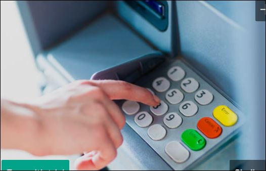
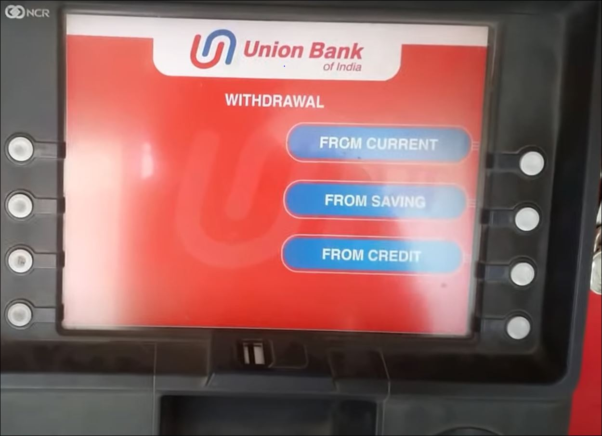
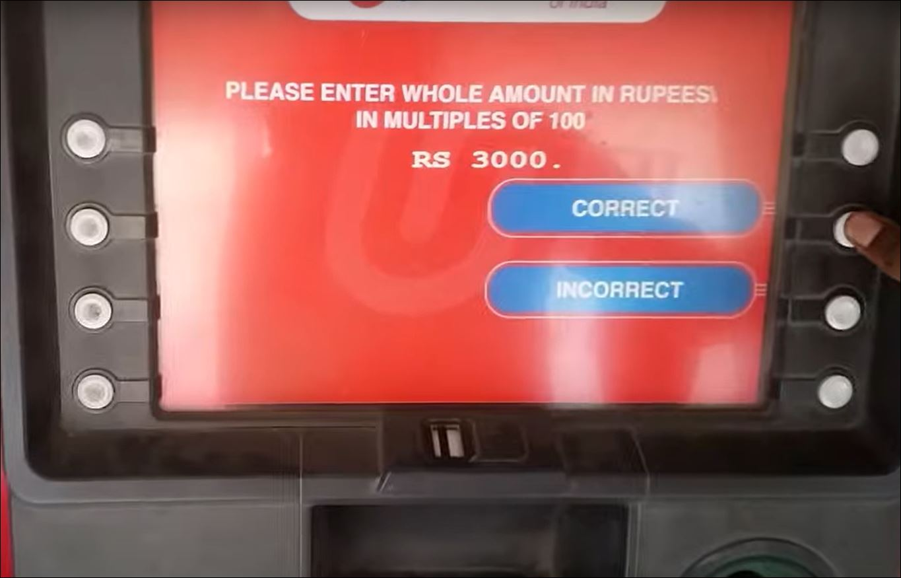

# Procedure for Withdrawing Money from an ATM

## Prerequisites:
- A **bank account** with sufficient funds and daily withdrawal limits.
- An **active ATM/Debit/Credit card** with a proper **PIN** (Personal Identification Number) linked with the bank account.
- **ATM location**.

---

## Procedure for Withdrawing Money from an ATM

### 1. Locate an ATM.
- *Note:* To avoid additional fees, find an ATM that is part of your bank’s network or a compatible network.

### 2. Insert your ATM/Debit/Credit card into the ATM.
- *Note:* Ensure that the card orientation is correct, as indicated on the ATM screen and card.

)

### 3. Enter your PIN.

### 4. Select the “Withdrawal” option from the menu.
![Select Withdrawal]step 4.JPG)

### 5. Select your account type.

### 6. Enter the amount of money you wish to withdraw.

### 7. Verify and confirm the transaction details.

### 8. Collect Cash and Receipt.

### 9. Retrieve your ATM/Debit/Credit card.

### 10. End Session.

---

You can easily follow this guide to safely withdraw money from an ATM.
